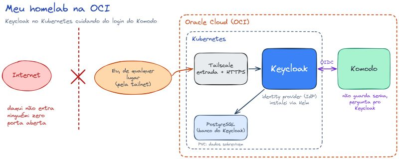
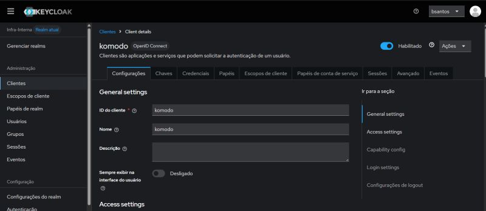
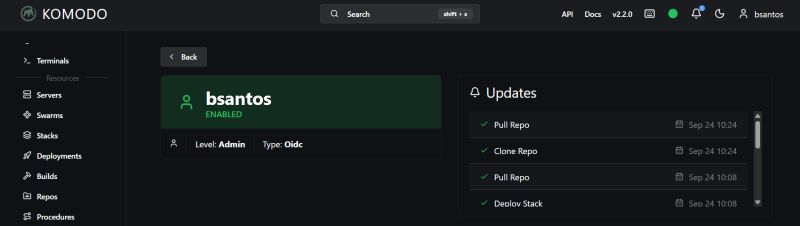

# 🔐 keycloak-kubernetes

**Keycloak como IdP central do meu homelab**, rodando no Kubernetes na Oracle Cloud — com login único (OIDC) pros serviços internos e **zero portas abertas pra internet**.



## Sobre

Eu terminei o curso de Keycloak e resolvi colocar ele pra trabalhar de verdade, em vez de só fazer labs. O cluster Kubernetes roda na Oracle Cloud (OCI) e o Keycloak virou o login central de tudo: qualquer serviço que sabe falar OIDC delega a autenticação pra ele, e ninguém precisa mais guardar senha própria.

O Komodo (que uso pra gerenciar os containers) é o exemplo mais claro — ele não guarda credencial nenhuma: quando alguém tenta entrar, ele joga a autenticação pro Keycloak via OIDC e pronto.

A parte que mais me interessa é o **Zero Trust de verdade**: não existe caminho da internet até o Keycloak. Sem porta aberta, sem DNS público, sem certificado Let's Encrypt — o Tailscale é a porta de entrada e emite o HTTPS com o certificado dele.

## Stack

| Camada | Tecnologia |
| --- | --- |
| Cluster | Kubernetes (Oracle Cloud OCI) |
| IdP | Keycloak 26+ (instalado via Helm) |
| Banco | PostgreSQL 17 (StatefulSet) |
| Exposição | Tailscale (ingress do chart desativado) |
| Cliente OIDC | Komodo |
| Gerência de pacotes | Helm / kubectl |

## Estrutura do repositório

| Arquivo | O que é |
| --- | --- |
| `keycloak-values.yaml` | Values do chart do Keycloak em produção: Postgres, `KC_HOSTNAME`, proxy headers e ingress desativado |
| `values.yaml` | Values enxutos pra subir rápido em dev/teste (`KC_DB=dev-file`, sem Postgres) |
| `postgres.yaml` | Service + StatefulSet do PostgreSQL 17 (namespace `keycloak`, PVC de 5Gi) |
| `docs/` | Diagrama da arquitetura e prints do Komodo/Keycloak |

## Arquitetura

1. **Tailscale como única entrada** — `ingress.enabled: false` no chart. O Tailscale entrega HTTPS com certificado próprio e o Keycloak só responde pra quem está na minha tailnet.
2. **Keycloak + PostgreSQL no namespace `keycloak`** — Keycloak instalado via Helm, banco num StatefulSet com disco persistente.
3. **Komodo (e os demais serviços) falam OIDC** — o app nunca vê a senha do usuário, só o token emitido pelo Keycloak.

Fluxo do login:

```
Eu (na tailnet) → Tailscale/HTTPS → Keycloak → token OIDC → Komodo
                     ✗ internet                  (não guarda senha)
```

## Deploy

### 1. Namespace e secrets

```bash
kubectl create namespace keycloak

kubectl -n keycloak create secret generic keycloak-db \
  --from-literal=password='<senha-do-postgres>'

kubectl -n keycloak create secret generic keycloak-admin \
  --from-literal=password='<senha-do-admin-do-keycloak>'
```

### 2. Banco de dados

```bash
kubectl apply -f postgres.yaml
kubectl -n keycloak rollout status statefulset/keycloak-postgres
```

### 3. Keycloak (Helm)

```bash
helm upgrade --install keycloak <seu-chart> \
  --namespace keycloak \
  --values keycloak-values.yaml
```

> Subindo só pra brincar, sem Postgres: troque o values por `values.yaml`.

### 4. Expor via Tailscale

Com o ingress do chart desativado, o serviço fica `ClusterIP` e o acesso externo vem do Tailscale (subnet router, ingress controller do Tailscale ou port-forward — do jeito que você preferir). Enquanto o cluster estiver na minha tailnet, **não existe rota vindo da internet até ele**.

## Configurando um cliente OIDC (Komodo)

No admin do Keycloak: **Clientes → Criar cliente** apontando pro Komodo, com o redirect URI dele e o fluxo padrão *Authorization Code*.



Do lado do Komodo, é só apontar a autenticação pro Keycloak (discovery endpoint do realm). O usuário aparece habilitado como **Type: OIDC**, sem senha local:



## ⚠️ O gotcha: Keycloak atrás de proxy

Esse foi o problema que mais me fez quebrar a cabeça: o Keycloak subia normal, eu fazia login e era **redirecionado pro endereço errado** — porque ele achava que estava servido em `http://` direto, sem o proxy na frente.

O que resolveu foi avisar o Keycloak sobre o proxy:

```yaml
extraEnv: |
  - name: KC_HOSTNAME
    value: https://keycloak.ling-becrux.ts.net   # a URL completa, com https
  - name: KC_PROXY_HEADERS
    value: xforwarded
```

Detalhe importante: a partir da **Keycloak 26**, `KC_HOSTNAME` passou a aceitar a **URL completa com esquema** (`https://...`), e não só o hostname. Somado ao `--proxy-headers=xforwarded` no `command` (já está no `keycloak-values.yaml`), o redirect volta certo.

Checklist rápido se o login redirecionar pra lugar errado:

- [ ] `KC_HOSTNAME` com o `https://` na frente
- [ ] `KC_PROXY_HEADERS` / `--proxy-headers=xforwarded` ativo
- [ ] O hostname bate com o que o Tailscale resolve na tailnet
- [ ] Valid Redirect URIs do cliente conferem com a URL de acesso

## Por que não expor nada pra internet

- **Sem porta aberta** — nada de 443/8080 publicado no Security List da OCI.
- **Sem DNS público** — o nome só resolve dentro da tailnet (MagicDNS).
- **Sem certificado público** — o Tailscale emite e renova o dele.
- **Sem senha guardada nos apps** — os serviços só validam token.

Se alguém não está na minha tailnet, simplesmente não existe caminho até o Keycloak.

---

Feito com Kubernetes, Keycloak, Tailscale e um pouco de café ☕
